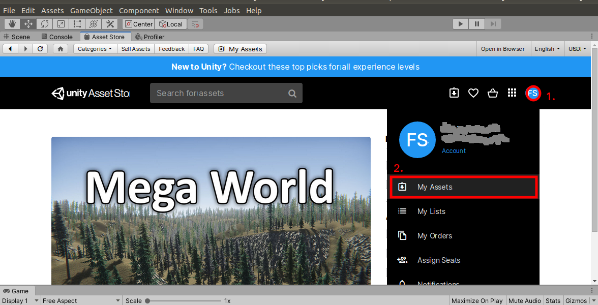

# Installation
As ConFormSim is an extension to the Unity ML-Agents Toolkit, make sure you have read the [ML-Agents installation guide](https://github.com/Unity-Technologies/ml-agents/blob/master/docs/Installation.md) and got a basic understanding of [how to work with Unity](https://github.com/Unity-Technologies/ml-agents/blob/master/docs/Background-Unity.md) and [how to use ML-Agents](https://github.com/Unity-Technologies/ml-agents/blob/master/docs/Getting-Started.md).

So after following the [ML-Agents installation (Release 3)](https://github.com/Unity-Technologies/ml-agents/blob/release_3_docs/docs/Installation.md) you will have the following requirements fulfilled:

- Installed Unity (2018.4 or later)
- Installed Python (3.6.1 or higher)
- Installed ML-Agents (1.0.3 or above)

### Clone the ConFormSim Repository

To add the ConFormSim functionality to your ML-Agents environment or test one of
the example environments you need to clone this repository to your local
machine. Change directory to your target location and run the following command:

```bash
git clone https://github.com/JohnBergago/ConFormSim.git
```

To download all the submodules execute the setup script:
```bash
cd ConFormSim
./setup.sh
```
The script initializes the
[ml-imagesythesis](https://bitbucket.org/Unity-Technologies/ml-imagesynthesis/src/master/)
submodule and the
[HelperAttribute](https://github.com/johnearnshaw/unity-inspector-help)
submodule. **In case you cannot run the script** (i.e. on Windows), change to
the ConFormSim directory and run:
```bash 
# download all submodules
git submodule update --init --recursive
```
Then copy the contents of `src/ml-imagesynthesis/Assets/ImageSynthesis` to
`src/ConFormSimProject/Assets/ConFormSim/External/ml-imagesynthesis`. 

### Get Required Libraries from the Asset Store
ConFormSim makes use of the [Serialized Dictionary
Lite](https://assetstore.unity.com/packages/tools/utilities/serialized-dictionary-lite-110992)
Implementation by RotaryHeart, to provide a nice UI in the Unity Editor and to
allow a high modularity. However, this Library is not available as Unity Package
in the Unity Package Manager. Therefore, it is not in the package
`manifest.json`. You have to download it from the Asset Store.

1. **Add the Serialized Dictionary to your Assets**: Follow this
   [link](https://assetstore.unity.com/packages/tools/utilities/serialized-dictionary-lite-110992)
   and log in to the Unity Asset Store with your Unity ID. Click `Add to my
   Assets` on the right side of the page. 
1. **Open the ConFormSimProject in Unity**: In the Projects tab in the UnityHub
   click `Add` and navigate to the `src/ConFormSimProject` directory. Choose the
   directory and open the project in Unity.
1. **Add the Serialized Dictionary Asset to the Project**: The project will load
   with some errors, mostly complaining about missing namespace references and
   unknown classes. Open the Asset Store either by clicking on the Asset Store
   tab in Unity, or by using the Menu `Ẁindow > Asset Store`. If you haven't
   already, log in to the Asset Store inside the Editor. Click on your Profile
   Icon and select `My Assets`<br> <br> Import the
   Serialized Dictionary to your project. <br>
1. **Move the Serialized Dictionary Folder to ConFormSim**: To create an
   all-in-one package, move the `RotaryHeart` folder to `ConFormSim/External` in
   your Assets. <br> 

### Add ConFormSim to Your ML-Agents Environment
Now that the repository and the project are set up, you can easily add the
ConFormSim features to your ML-Agents reinforcement learning environment by
dragging the `src/ConFormSimProject/Assets/ConFormSim` folder into the Assets
folder in the Project View of your environment. <br>


## Next Steps

- [Getting Started](GettingStarted.md)
- [Object Property System](ObjectPropertySystem.md)
- [Action System](ActionsSystem.md)